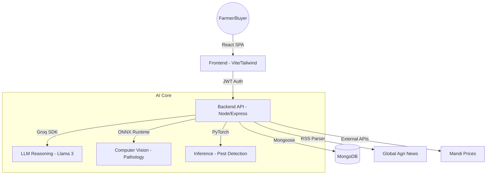

# 🌿 Khetibuddy 2.0: Next-Gen AI Agricultural Ecosystem

[](https://reactjs.org/)
[](https://nodejs.org/)
[](https://groq.com/)
[](LICENSE)

**Khetibuddy 2.0** is an exhaustive, AI-driven agricultural advisory and management system designed to empower farmers with real-time intelligence, autonomous pathology, and a seamless marketplace. Built with a "Mobile-First, Cinematic UX" philosophy, it combines state-of-the-art Large Language Models (LLMs) with specialized Computer Vision to solve core agricultural challenges.

---

## 🚀 Core Features

### 1. 🔍 Autonomous Disease Diagnosis
Two distinct paths for crop health assessment:
- **Visual Analysis**: Upload a high-resolution photo of a diseased plant. Our integrated **ONNX-based Deep Learning model** performs real-time edge inference to identify the pathology.
- **Manual Diagnosis**: Describe observed symptoms in natural language. The system uses the **Groq Llama-3-70B model** to reason through symptoms and provide a detailed diagnosis, cause analysis, and treatment plan.

### 2. 🤖 Multilingual AI Agri-Chatbot
A 24/7 digital consultant powered by the Groq SDK. 
- Supports query processing in multiple languages.
- Provides specialized advice on crop rotation, soil preparation, and climate adaptation.
- Includes session-based history for continuous advisory.

### 3. 🧪 Intelligent Fertilizer Advisory
A data-driven recommendation engine that takes Nitrogen (N), Phosphorus (P), and Potassium (K) values along with crop type to generate:
- Precise fertilizer requirements.
- Personalized application schedules.
- Soil health improvement tips.

### 4. 🪲 AI Pest Detection
Utilizes a specialized **PyTorch-based model** (`pest_model.pth`) to identify harmful insects and pests from images, offering immediate organic and chemical control strategies.

### 5. 🛒 Smart Agri-Marketplace
A specialized B2B and B2C marketplace with dedicated roles:
- **Buyers**: Can browse produce, check quality certifications, and purchase directly from farmers.
- **Sellers**: Can list crops, manage inventory, and access market analytics.
- **Dashboard**: Integrated analytics for tracking sales and purchasing history.

### 6. 📈 Real-time Mandi & News Ticker
- **Global News Ticker**: Fetches real-time agricultural news via RSS, displayed in a cinematic ticker.
- **Mandi Price Tracker**: Provides location-based market rates for various commodities to ensure fair pricing.

---

## 🛠️ Technology Stack

### Frontend
- **Framework**: React.js with Vite (Lightning-fast build tool).
- **Styling**: Tailwind CSS (Utility-first CSS) + Custom Cinematic Design System.
- **Animations**: Framer Motion (Fluid, premium transitions).
- **Icons**: Lucide React.
- **State Management**: React Context API & Hooks.

### Backend
- **Runtime**: Node.js & Express.
- **Database**: MongoDB with Mongoose ODM.
- **Authentication**: JWT (JSON Web Tokens) with Cookie-based storage.
- **Security**: Bcrypt.js (Password hashing), Express-Rate-Limit (DDOS protection).
- **File Handling**: Multer & Sharp (Image optimization).

### AI & Machine Learning
- **LLM Engine**: Groq SDK (Llama-3-70B) for lighting-fast reasoning.
- **Vision Inference**: ONNX Runtime Node.js for plant disease detection.
- **Model Training**: PyTorch for pest detection.

---

## 🏗️ Technical Architecture



---

## ⚙️ Installation & Setup

### Prerequisites
- Node.js (v18+)
- MongoDB (Local or Atlas)
- Groq Cloud API Key
- Unsplash API Key (for dynamic disease imagery)

### 1. Clone the Repository
```bash
git clone https://github.com/YourRepo/Khetibuddy-2.0.git
cd Khetibuddy-2.0
```

### 2. Backend Configuration
```bash
cd Khetibuddy/backend
npm install
```
Create a `.env` file in the `backend` folder:
```env
PORT=5000
MONGODB_URI=your_mongodb_connection_string
JWT_SECRET=your_super_secret_key
GROQ_API_KEY=your_groq_key
NODE_ENV=development
```
Start the backend:
```bash
npm run dev
```

### 3. Frontend Configuration
```bash
cd Khetibuddy/frontend
npm install
```
Create a `.env` file in the `frontend` folder:
```env
VITE_API_URL=http://localhost:5000
VITE_UNSPLASH_KEY=your_unsplash_key
```
Start the frontend:
```bash
npm run dev
```

---

## 📂 Project Structure

```text
Khetibuddy/
├── backend/
│   ├── config/          # DB & App config
│   ├── controllers/     # Business logic
│   ├── models/          # Mongoose schemas
│   ├── routes/          # API endpoints
│   ├── middleware/      # Auth & Rate limiting
│   ├── services/        # External API integrations
│   └── server.js        # Entry point
├── frontend/
│   ├── src/
│   │   ├── components/  # Reusable UI elements
│   │   ├── pages/       # Main feature pages
│   │   ├── hooks/       # Custom React hooks
│   │   ├── services/    # API abstraction
│   │   └── context/     # Global state
│   └── tailwind.config.js
└── README.md
```

---

## 🛡️ License
Distributed under the **MIT License**. See `LICENSE` for more information.

## 👥 Contributors
- **Development Team**: Advanced AI & Web Engineering Group.
- **Inspiration**: Empowering the backbone of our society—Farmers.

---

**Khetibuddy 2.0** - *Cultivating Intelligence, Harvesting Growth.* 🌾✨
